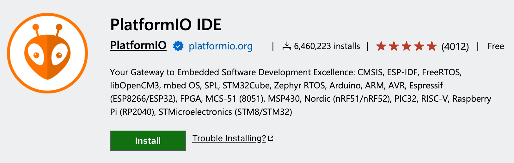
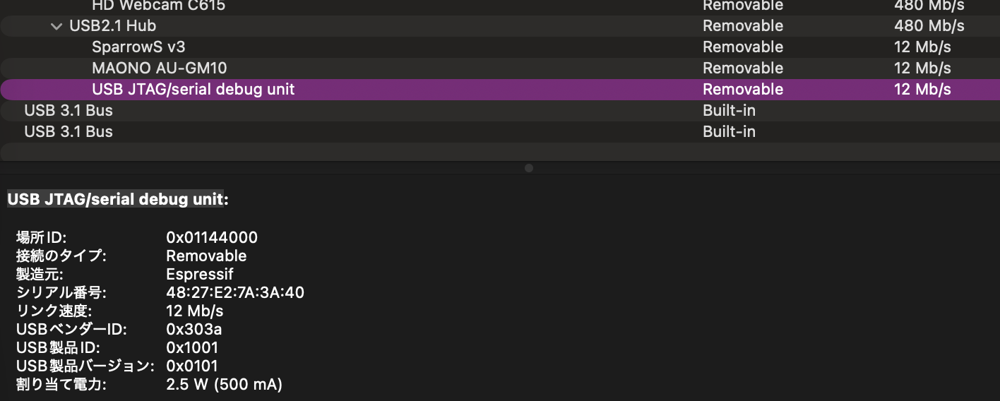

# 3. ファームウェア開発

この章では、ｽﾀｯｸﾁｬﾝのファームウェア開発に必要だった技術を紹介します。

## 3.1. PlatformIO

### PlatformIOとは

PlatformIOは、組み込み開発のためのクロスプラットフォームなビルドシステムです。
ESP32シリーズは、RISC-VとXtensaの両方のCPUアーキテクチャが使われており、ビルドに必要なツールがPC用のものとは異なります。
また、コンパイルだけではなく、書き込みなどにも特定のツールが必要になります。
PlatformIOは、これらのツールをパッケージ化して提供しており、ESP32の開発環境を簡単に整えることができます。
ライブラリに対するパッケージマネージャも付属しております。
ビルド、書き込み、モニタリングなどを、異なるマイコンに対して統一的に行えるコマンド体系を持っており、異なるマイコン開発でも同じコマンド体系で開発できるのも便利です。

同様にIDEとビルドシステムが統合されたものに、Arduinoフレームワーク専用IDE、Arduino IDEがあります。
Arduino IDEは、入門者が迷わないように、コードを1ファイルだけで完結させる思想になっています。
筆者はファイル分割してコードを管理したいことが多いのと、慣れたVS Codeで開発したいため、PlatformIOを利用しています。

PlatformIOでは、複数のフレームワークをサポートしており、ESP32シリーズも、ArduinoフレームワークとESP-IDFフレームワークの両方をサポートしています。
ただし、PlatformIO公式のESP32シリーズのArduinoフレームワークのサポートが行われているESP32プラットフォームのパッケージは、事情があって2系バージョンのまま更新が停止されています。
現在は、3系バージョンが利用できるコミュニティpioarduinoがメンテナンスしているESP32プラットフォームパッケージを利用するのが良いでしょう。

### PlatformIOのインストール

筆者はESP32シリーズの開発にはPlatformIOを利用しています。
PlatformIOは、VS Codeの拡張機能として提供されています。
利用するには、VS Codeをインストールして、サイドバー拡張機能のタブから「PlatformIO IDE」を検索してインストールします。



### PlatformIOのプロジェクトの作成

通常、PlatformIOで開発を始める時には、以下の手順を取ります。

- PlatformIOのHome画面から、目的のMCUにあわせて「Platform」を追加する
- PlatformIOのHome画面から、プロジェクト作成ウィザードを起動して、目的の「ボード」と「フレームワーク」を選択して、プロジェクトを作成する

この手順では、PlatformIOによって、設定ファイルである`platformio.ini`ファイルと、`src`、`include`、`lib`などのディレクトリが作成され、最初の`src/main.cpp`などのエントリーファイルも作成されます。

筆者の場合には、PlatformIOのプロジェクトの作成は`platformio.ini`ファイルを直接作成して行うことが多いです。
生成された状態から`platformio.ini`を追加で更新したり、パッケージ名をgitのtagを指定してバージョンを固定したりすることが多いです。

M5Stackシリーズ向けのPlatformIOの設定を、さいとてつや（[@saitotetsuya](https://x.com/saitotetsuya)）さんが以下のリポジトリでまとめてくださっています。

> 3110/m5stack-platformio-boilerplate-code: PlatformIO IDE 向け M5Stack 定型コード環境 / Boilerplate Code for M5Stack in PlatformIO IDE Environment<br/>https://github.com/3110/m5stack-platformio-boilerplate-code

M5Stackのファームウェアを構築するときには、このリポジトリから設定をコピーさせてもらっています。

新しいプロジェクトを作る時には、このリポジトリにある以下の3つをコピーします。

- [platformio-m5stack.ini](https://github.com/3110/m5stack-platformio-boilerplate-code/blob/main/platformio-m5stack.ini)
- [platformio.ini](https://github.com/3110/m5stack-platformio-boilerplate-code/blob/main/platformio.ini)
- [src/](https://github.com/3110/m5stack-platformio-boilerplate-code/tree/main/src)

PlatformIOでは、envという設定で、複数のビルド設定を定義できます。
このリポジトリでは、M5Stackの製品と、M5Unified（後述しますが、M5Stackの開発ライブラリ）を使うかどうかでenv設定を分けて管理しています。
デフォルトで使われるenvは`[platformio]`セクションの`default_envs`で指定されているものになります。
使うM5Stack製品に合わせて、`default_envs`の値を変更して利用します。

今回M5Stack CoreS3をM5Unifiedを使って開発するため、`default_envs`の`m5stack-cores3-m5unified`に設定するように、コメントアウトを外しました。

```ini
# platformio.ini

[platformio]
; default_envs = m5stack-core2-m5unified
; default_envs = m5stack-cores3
default_envs = m5stack-cores3-m5unified
; default_envs = m5stick-c
```

このリポジトリでは、MCUがESP32-C6、ESP32-P4を使うプロダクトでのみpioarduinoのESP32プラットフォームのパッケージを利用し、それ以外のプロダクトではPlatformIO公式のESP32プラットフォームのパッケージを利用するようになっています。
ESP-SRという機能が、3系フレームワーク出なければ利用できないため、pioarduinoを使う必要があります。
そのため、ESP32-S3でもpioarduinoを使うように`platformio-m5stack.ini`ファイルの`[esp32s3]`セクションの`extends`に`platform-pioarduino`を追加しました。

```ini
# platformio-m5stack.ini

[esp32s3]
extends = platform-pioarduino ; 追加
board_build.mcu = esp32s3
```

### PlatformIOでのCore S3への書き込み

これで、ファームウェアを書き込めるか確認しましょう。
ステータスバーにアップロード機能である{width="12px"}のアイコンが増えているので、これをクリックすると、ビルドと書き込みが始まります。
書き込みが完了するのを確認しましょう。

Core S3のMCUのESP32-S3には、USBデバイスの機能が含まれています。
通常時は、USBシリアル、USBデバッガーデバイスとして認識し、USBシリアル経由でファームウェアの更新が可能です。
USBデバイスの一覧に「USB JTAG/serial debug unit」として表示されていれば、認識されていることになります。
USBデバイスとしてファームウェアを作成した場合には、USBシリアルデバイスとしては認識されません。
その時にはSDカードスロットとなりのリセットボタンを3秒ほど押すと、LEDが点灯し、書き込めるダウンロードモードとして起動し、USBシリアルデバイスとして認識されるようになります。
この状態で、ファームウェアの書き込み（アップロード）を行いましょう。



USBシリアルデバイスとして認識している場合、Arduinoの`Serial.print("Hello, World!");`のようなコードで、シリアルモニタに出力することができます。
シリアルモニタを起動するにはステータスバーにモニタリング機能である{width="12px"}のアイコンをクリックします。

なお、PCに複数のUSBシリアルデバイスが接続されている場合、自動で選択して接続してくれます。
手動で指定する場合には、`platformio.ini`の`[env]`セクションにポートを指定できます。

```ini
# platformio.ini

[env]
; windowsの場合の例
upload_port = COM16
; Linuxの場合の例
upload_port = /dev/ttyACM0
```

時折、USBが認識しているにもかかわらずアップロードが動かないことがあります。
その時には、一度Core S3をリセットして、再度アップロードを試してみると、うまくいくことがあります。

## 3.5. WebSocket通信

このプロジェクトでは、Pythonで立てたWebSocketサーバに対して、ｽﾀｯｸﾁｬﾝ側はWebSocketクライアントとして接続し、通信を行っています。

ESP32のArduinoで使えるWebSocketライブラリに、以下のリポジトリがあります。

> Links2004/arduinoWebSockets: arduinoWebSockets<br/>https://github.com/Links2004/arduinoWebSockets

筆者はこれを使って、ESP32をWebSocketサーバにしたり、クライアントにしたり、手軽なサーバやブラウザとの通信手段として使っています。
他にも通信を可能とするプロトコルはありますが、Webサーバの技術と親和性が高いこと、このライブラリで十分実装しやすいことから、WebSocketを通信手段としてよく使います。
特に、接続確認や再接続の処理も含まれているため非常に使いやすいです。

では実装例を見ていきましょう。

まず、ESP32からWiFiに接続するには、以下のようにします。

```cpp
#include <WiFi.h>

const char *WIFI_SSID = "hoge";
const char *WIFI_PASS = "hogehoge";

void connectWiFi()
{
  WiFi.mode(WIFI_STA);
  WiFi.begin(WIFI_SSID, WIFI_PASS);
  while (WiFi.status() != WL_CONNECTED)
  {
    delay(300);
  }
}

void setup() {
  connectWiFi();
}
```

WebSocketのイベントのコールバック関数handleWsEventを実装します。

```cpp
#include <WebSocketsClient.h>

void handleWsEvent(WStype_t type, uint8_t *payload, size_t length)
{
  switch (type)
  {
  case WStype_DISCONNECTED:
    // 切断された
    break;
  case WStype_CONNECTED:
    // 接続が成功した
    break;
  case WStype_TEXT:
    // テキストメッセージが届いた
    // payloadにテキストバイナリが入っている
    break;
  case WStype_BIN:
    // バイナリメッセージが届いた
    // payloadにバイナリデータが入っている
    break;
  default:
    break;
  }
}
```

主に、テキストメッセージ、バイナリメッセージが届いたときの処理を実装することになります。

```cpp
#include <WebSocketsClient.h>

const char *SERVER_HOST = "192.168.1.191"; // サーバのIP
const int SERVER_PORT = 8080;              // WebSocketのポート
const char *SERVER_PATH = "/ws/stackchan"; // WebSocketのパス

// クライアントオブジェクト
static WebSocketsClient wsClient;

void setup() {
  // 前略

  // 接続開始
  wsClient.begin(SERVER_HOST, SERVER_PORT, SERVER_PATH);
  // ハンドラの登録
  wsClient.onEvent(handleWsEvent);
  // 自動再接続周期
  wsClient.setReconnectInterval(2000);
  // 接続が生きているかチェックされる周期
  // 引数1: 送信するpingの周期
  // 引数2: pongが返ってこないときに切断するまでの時間
  // 引数3: pongが返ってこないときに切断するまでの回数
  wsClient.enableHeartbeat(15000, 3000, 2);
}
```

これでサーバからテキストかバイナリを送ると、handleWsEventのコールバック関数が呼び出されるようになります。
クライアントから、バイナリを送るときにはsendBIN()関数を、テキストを送るときにはsendTXT()関数を呼び出します。

ｽﾀｯｸﾁｬﾝ実装では、バイナリで音声データを送ったり、コマンドを送ったり、複数種類のデータをやりとりしています。
どのデータかみ分けるために、バイナリメッセージの先頭にヘッダーを付けるようにしました。

```cpp
enum class MessageKind : uint8_t
{
	AudioPcm = 1, // クライアントマイク音声
	AudioWav = 2, // クライアントスピーカー
	StateCmd = 3, // クライアントのステート変更コマンド
	WakeWordEvt = 4, // ウェイクアップワード検出
	StateEvt = 5, // クライアントのステート変更イベント
	SpeakDoneEvt = 6, // クライアントの発話完了イベント
};

// ストリーミング転送時のSTART/END命令
enum class MessageType : uint8_t
{
	START = 1,
	DATA = 2,
	END = 3,
};

struct __attribute__((packed)) WsHeader
{
	uint8_t kind;        // 種類
	uint8_t messageType; // メッセージタイプ
	uint8_t reserved;    // 0 (flags/reserved)
	uint16_t seq;        // シーケンス番号
	uint16_t payloadBytes; // ヘッダーに続くバイト数
};
```

受信イベントで、このヘッダーに応じて、それぞれの処理を呼び出します。

```cpp
void handleWsEvent(WStype_t type, uint8_t *payload, size_t length) {
  switch (type)
  {
  case WStype_BIN:
  {
    // ヘッダーの読み取り
    WsHeader rx{};
    memcpy(&rx, payload, sizeof(WsHeader));
    size_t rx_payload_len = length - sizeof(WsHeader);

    const uint8_t *body = payload + sizeof(WsHeader);
    log_i("WS bin kind=%u len=%d", (unsigned)rx.kind, (int)length);

    // kindに応じてそれぞれのモジュールを呼び出す
    switch (static_cast<MessageKind>(rx.kind))
    {
    case MessageKind::AudioWav:
      // スピーカー再生
      // 略
      break;
    case MessageKind::StateCmd:
      // 状態変更
      // 略
      break;
    // 以下略
```

クライアントからの送信時も同様にします。
これで、様々な命令をやりとりできるようになりました。

## 3.2. M5Unified

### M5Unifiedとは

M5Unifiedとは、M5Stackシリーズの開発ライブラリです。
Arduinoフレームワークの上で動作するようになっています。
どのM5Stack製品でも同じAPIで開発できるように、統一化されたAPIを提供しています。
現在M5Stackを使った開発をするのであれば、M5Unifiedを利用するのが良いでしょう。

> m5stack/M5Unified: Unified library for M5Stack series<br/>https://github.com/m5stack/M5Unified

M5Unifiedを使ってPlatformIOで開発する場合、`platformio.ini`の設定に依存するライブラリとして追加する必要があります。
先のさいとうてつやさんのリポジトリのPlatformIOの設定では、その設定も含まれています。

### M5Unified利用の基本

M5Unifiedを利用する場合、最低限以下の記述が必要になります。

```cpp
#include <M5Unified.h>

void setup() {
  auto cfg = M5.config();
  M5.begin(cfg);
}

void loop() {
  M5.update();
}
```

### ディスプレイの描画

コアシリーズが開発に使いやす点は、フルカラーディスプレイが付属し、M5Unifiedから簡単に扱えるようになっている点です。
`M5.Display` オブジェクトを通じて、ディスプレイに描画することができます。

簡単に実装例を示します。
詳細なAPIはM5GFXというライブラリのドキュメントを参照してください。

> M5GFX API<br/>https://docs.m5stack.com/ja/arduino/m5gfx/m5gfx_functions

#### 画面の塗りつぶし

画面の初期化として、画面全体を塗りつぶすことができます。

```cpp
M5.Display.fillScreen(TFT_BLACK);
```

#### テキストの描画

printf、println命令で文字を描画する命令が付属しています。
文字を描画する際に便利です。
日本語フォントも搭載しています。

```cpp
// カーソルの位置を指定
M5.Display.setCursor(10, 10);
// フォントサイズを指定
M5.Display.setTextSize(3);
// 文字描画の背景色、文字色を指定
M5.Display.setTextColor(TFT_BLACK, TFT_BLUE);
// 文字を描画
M5.Display.printf("Command: %d,", command_id);
```

#### 図形の描画

drawXXX/pushXXXという命令と、writeXXXという命令が用意されています。
drawXXX/pushXXXは、呼び出しの度に描画顔熟れる命令です。
writeXXXは、startWrite();とendWrite();で囲んだ範囲で実行し、endWrite();のタイミングでまとめて描画される命令です。
writeXXXの方が、まとめて描画されるため、描画のパフォーマンスが高くなります。
ただ、drawXXX/pushXXXの方が命令が豊富であるため、特に描画に支障がなければdrawXXX/pushXXXを利用し、最適化したくなったらwriteXXXを利用するくらいで良いのではないかと思っています。

ｽﾀｯｸﾁｬﾝの顔の描画に以下のようにしていました。

```cpp
// 黒で塗りつぶし
M5.Display.fillScreen(TFT_BLACK);

uint32_t eye_y = 102;
uint32_t between_eyes = 135;
uint32_t eye_size = 8;
uint32_t mouth_y = 157;
uint32_t mouth_width = 85;
uint32_t mouth_height = 4;
// 白を円で描画
M5.Display.fillCircle(160 - between_eyes / 2, eye_y, eye_size, TFT_WHITE);
M5.Display.fillCircle(160 + between_eyes / 2, eye_y, eye_size, TFT_WHITE);
// 口を四角で描画
M5.Display.fillRect(160 - mouth_width / 2, mouth_y, mouth_width, mouth_height, TFT_WHITE);
```

#### PNG、JPGの描画

まず、画像ファイルをファームウェアから参照するには複数の方法があり、ここでは2つの方法を紹介します。

- ファームウェアのバイナリを埋め込む
- パーティションのSPIFFS領域に画像ファイルを置いて参照する

ESP32は外付けのフラッシュメモリからファームウェアのコードを読み込んで動作します。
このフラッシュメモリのデータ領域（CoreS3の場合は16MB）はパーティションで分かれています。
パーティションには、ファームウェアの領域以外に、SPIFFSというファイルシステムを持つ領域があります。
初期設定では、3MBほどがSPIFFS領域になっています。

少量のファイルであればファームウェアのバイナリに置いてしまって良いと思います。
まず、ファームウェア内に画像ファイルを書き込んで表示する方法を紹介します。

まず、platformio.iniの`[env]`セクションに、以下のようにして、画像ファイルをビルド時にファームウェアに書き込む設定を追加します。

```ini
[env]
board_build.embed_files =
    data/74th_64x64.png
```

ソースコード上でこのバイナリを参照するには、以下のようにファイル名の`/`、`.`記号を`_`に置き換えた名前の配列ポインタ`_binary_XXX_start`、`_binary_XXX_end`を定義します。

```cpp
// main.cpp
extern const uint8_t _binary_data_74th_64x64_png_start[];
extern const uint8_t _binary_data_74th_64x64_png_end[];
```

このファイルのファイルサイズを計算し、x:128、y:32の位置に描画するには、以下のようにします。

```cpp
const uint8_t* png_start = _binary_data_74th_64x64_png_start;
const uint8_t* png_end = _binary_data_74th_64x64_png_end;
const uint32_t png_size = static_cast<uint32_t>(png_end - png_start);
M5.Display.drawPng(png_start, png_size, 128, 32);
```

次に、SPIFFSを使う場合の方法を紹介します。

platformio.iniの`[env]`セクションに、以下のようにして、SPIFFS領域に画像ファイルを置いて参照する設定を追加します。

```ini
[env]
board_build.filesystem = spiffs
```

SPIFFSに書き込むファイルは`data`ディレクトリに置きます。
書き込むには、VS CodeのサイドバーのPlatformIOを開き、PROJECT TASKS中の「Upload Filesystem Image」をクリックします。
もしくは、PlatformIOのCLIを導入している場合、以下のコマンドを実行します。

```bash
pio run --target uploadfs
```

次にファームウェアコードで、`#include <SPIFFS.h>`を`#include <M5Unified.h>`の"前に"追加します。
"前に"追加が必要なのが注意です。

```cpp
#include <SPIFFS.h>
#include <M5Unified.h>
```

そしてコード中で、SPIFFSを初期化して、画像ファイルを描画します。

```cpp
M5.Display.fillScreen(TFT_BLACK);
M5.Display.drawPngFile(SPIFFS, "/74th_64x64.png", static_cast<int>(pos_x), static_cast<int>(pos_y));
```

#### スプライトの描画

M5Unifiedでは、drawXXX/pushXXXの命令を実行すると逐次描画が行われます。
一度黒背景を描画してから、それぞれ描画する場合、画面がちらついて見えてしまうことがあります。
その際writeXXX命令を使用して、まとめて描画することもできますが、スプライト機能を使うのも良いでしょう。
スプライト機能では、一度描画はスプライトに対して行い、スプライトを画面に描画することで一度に画面を書き換えられます。

スプライトと使うには、まずスプライトオブジェクトを作成します。

```cpp
LGFX_Sprite hud(&M5.Display);
```

そして、`M5.Display`の代わりにスプライトオブジェクトに対して描画命令を実行します。
最後に、pushSprite()命令で、スプライトを画面に描画します。

```cpp
hud.fillScreen(TFT_BLACK);
hud.drawPngFile(SPIFFS, "/74th_64x64.png", static_cast<int>(pos_x), static_cast<int>(pos_y));
hud.pushSprite(0, 0);
```

### マイク音声のストリーミング取得

マイクの音声は`M5.Mic`オブジェクトを通じて取得できます。
`M5.Mic.begin()` でマイクを初期化して、`M5.Mic.record()`で音声を取得します。

```cpp
const size_t MIC_READ_SAMPLES = 256;
const int SAMPLE_RATE = 16000; // 16kHz

void setup() {
  // マイクの稼働開始
  M5.Mic.begin();
}

void loop() {
  M5.update();
  // バッファ
  static int16_t mic_buf[MIC_READ_SAMPLES];
  if (M5.Mic.record(mic_buf, MIC_READ_SAMPLES, SAMPLE_RATE)) {
    // バッファに書き込めた
  }
}
```

`M5.Mic.record()`の引数でステレオ・モノラルが指定できますが、初期値はモノラルになっています。

実際にこの関数を読み出してみると、途切れなく読み取ることに苦労しました。
サンプル256であれば、16,000 Hz / 256 = 62.5回/秒の頻度で呼び出す必要があります。
これを0.5秒ごと（8,000サンプル）に通信でバッファし、後に説明するWebSocketで送る用に実装しました。
そのようにしたところ、途切れなく送れるようになりました。

一方、マイク利用時の注意として、コアシリーズに搭載されたマイクは決して性能の良いマイクではありません。
録音された音声データの音質が実用範囲か確かめつつ使う必要があります。

### スピーカーでストリーミング音声出力

スピーカーの音声出力は、`M5.Speaker`オブジェクトを通じて行えます。
begin() でスピーカーを初期化して、 playRaw() で音声を出力します。
以下がその実行サンプルです。

```cpp
const int SAMPLE_RATE = 24000; // 24kHz

//　音声データのバッファ
std::vector<uint8_t> buf;

void setup() {
  // スピーカーの稼働開始
  M5.Speaker.begin();
  // buf
}

void loop() {
  M5.update();

  // ここにbufに音声データを入れる処理

  // 8bit配列を、16bitに置き換えて、スピーカーに渡す
  const int16_t *samples = reinterpret_cast<const int16_t *>(buf.data());
  size_t sample_len = buf.size() / sizeof(int16_t);
  // 音声を出力
  // 引数1: 音声データの配列
  // 引数2: 音声データのサンプル数
  // 引数3: サンプリングレート
  // 引数4: true: ステレオ, false: モノラル
  // 引数5: 繰返し回数
  // 引数6: スピーカーチャンネル、0で良い
  // 引数7: 現在の再生を中断するか
  M5.Speaker.playRaw(samples, sample_len, SAMPLE_RATE, false, 1, 0, false);
}
```

音声データを再生する場合、全ての音声データが届いてから再生したのでは、長さに応じたバッファが必要です。
バッファサイズに分けて送信し、届き次第ストリーミングで再生すると良いでしょう。
このplayRaw()関数は、引数7で、現在の再生を中断するかどうか指定でき、falseにしておけば、再生中に関数を呼び出して前のデータに繋げて再生できます。

私の製作では、実際に2秒ごとに音声を分割して送信し、届き次第再生するように実装しました。
2秒ごとに音声を送る制御はサーバ側で行い、クライアントは適切なタイミングで繰る音声データをひたすらplayRaw()で再生するように実装しました。

なお、playWav() を使えばWavファイルを再生することもできます。
組み込みの効果音などは、embeddedファイルとして追加して、 playWav() で再生するのも良いでしょう。

確実に動作しないかどうか確認していないのですが、`M5.Mic.begin()` と `M5.Speaker.begin()` と同時にマイクとスピーカーが動作する状態の時に、マイクが正しく取れていないことがありました。
筆者の実装では、逐一 end() を呼び出し、マイクとスピーカーが同日に begin() で実行された状態にならないように制御しています。

## 3.3. サーボモータの操作

TODO: 後で書く

## 3.4. WakeupWord検出をESP-SRで実現する

ウェイクアップワードとは、音声認識システムにおいて、ユーザが特定のコマンドを発したことを検出するためのキーワードのことです。
スタックチャンで常に音声を解析し、即座に応答させることもできますが、音声認識をずっと稼働させているとかなりの費用がかかります。
ウェイクアップワードの検出のみをエッジデバイスで行い、ウェイクアップワードが検出されたときにサーバに通知して、サーバ側で音声認識を行うようにするのが、コスト的にも効率的にも良いでしょう。

robo8080さんのAIスタックチャンのファームウェアには、ウェイクアップワードの検出機能が実装されています。
こちらを利用しても良いでしょう。

ESP32の製造元であるEspressif社が提供しているESP-SRという音声認識ライブラリがあります。

> espressif/esp-sr: Speech recognition<br/>https://github.com/espressif/esp-sr

ESP32上で稼働が可能ながら、ノイズ抑制、エコーキャンセルなど、多くの要素が実装されています。
ウェイクアップワード検出と、命令検出の2つの機能があります。
ウェイクアップワードはワードに応じたモデルデータが必要になっています。
ESP-SRには既に複数のモデルが提供されているのですが、なんと「Hi! Stackchan」というスタックチャン向けのモデルも含まれています。
こちらを使えると良さそうです。
なお、命令検出については、英語と中国語のモデルのみが提供されており、日本語には対応していません。

ESP32のArduinoライブラリには、ESP-SRを使う機能も含まれています。
しかし、筆者が試したところ、M5Unifiedとうまく共存させることができませんでした。
そこで、M5Unifiedから得たマイクデータをESP-SRに投入するためのライブラリを作りました。

> 74th/ESP-SR-For-M5Unified<br/>https://github.com/74th/ESP-SR-For-M5Unified

こちらを使うと、`M5.Mic.record()`で取得したデータを渡すだけで、ESP-SRの音声認識が使えるようになります。
実装例は以下の通りです。
ウェイクアップワードが検出されるとonSrEvent()が呼ばれます。

```cpp
#include <M5Unified.h>
#include <ESP_SR_M5Unified.h>

// 検出イベント
void onSrEvent(sr_event_t event, int command_id, int phrase_id) {
  (void)command_id;
  (void)phrase_id;
  if (event == SR_EVENT_WAKEWORD) {
    // ウェイクアップワードが検出された
    ESP_SR_M5.setMode(SR_MODE_WAKEWORD);
  }
}

void setup() {
  M5.begin();

  // マイクの有効化
  M5.Mic.begin();

  // ESP-SRの有効化
  ESP_SR_M5.onEvent(onSrEvent);
  ESP_SR_M5.begin(nullptr, 0, SR_MODE_WAKEWORD, SR_CHANNELS_MONO);
}

void loop() {
  M5.update();

  // 音声データをESP-SRに渡す
  static int16_t audio_buf[256];
  if (M5.Mic.record(audio_buf, 256, 16000, false)) {
    ESP_SR_M5.feedAudio(audio_buf, 256);
  }
}
```

より詳しい組み込み方はリポジトリの説明を参照してください。
FLASHのパーティション中にモデルを書き込むなど、インクルードすれば動く状態にはなっていません。

筆者の製作では、このESP-SRをウェイクアップワード技術に採用しました。
検出精度は、筆者の発音が悪いのか、3回に1回くらい失敗するくらいです。
ですが、イベント会場のある程度騒がしい場所でも動作しています。
