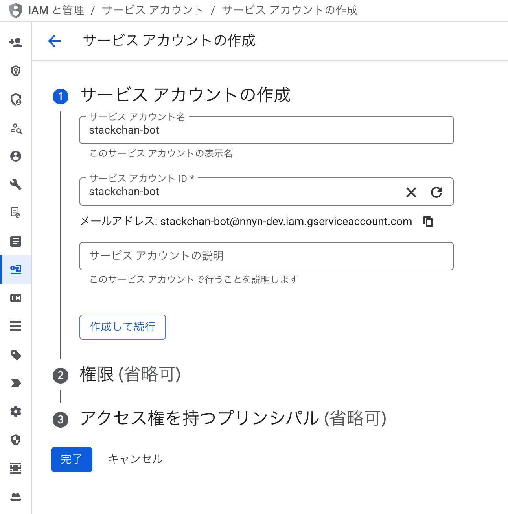

# 4. AIエージェント

この章では、AIエージェントの開発について解説します。

## 4.1. AIエージェント開発

昨今、AIエージェントを用いたソフトウェア開発が盛んになっています。
筆者の仕事はソフトウェア開発なのですが、仕事でも、趣味でもソフトウェア開発にAIエージェントを活用しています。

AIエージェントの作り方には、「汎用エージェント」と「特化型エージェント」があると思っています。


「特化型エージェント」は特定タスクをこなすためのエージェントで、その構築には「思考やツール実行の手順をワークフローとして定義する」ことで、目的のタスクを高確率でこなせるように作り込みます。
この作り込みにはLangChainのようなワークフローを組むフレームワークを用いることになります。
より高度なことを、確実にさせようと思うならばこの特化型のアプローチが良いと思います。

一方、普段コーディングや、日常的なチャットボットとして利用しているのは「汎用エージェント」です。
汎用エージェントには、「役割」「スキルと呼ばれるノート集」「MCPによる外部ツール連携」などを通して、LLMに自由にタスクをこなしてもらいます。
エージェントが各スキルを参照したり、ツールを使うかどうかは、最初に与えた役割となるプロンプトを与えて、LLMが参照・使用すべきと考えなければ使われません。
普段使いするチャットボットには、LLMモデルの持ち前の思考力で、「情報収集」をしてもらったり「コードの生成」や「壁打ち議論」をしてもらったり、多様なタスクを依頼することが多いです。
お家に、AIエージェントを置くならば「特化型エージェント」というよりは「汎用型エージェント」を置いて、「Webの簡単な調べごと」や「相談」など、日常的にいろいろなことを頼めるようにしたいと思いました。
よって、本書では「汎用型エージェント」を作るように考えます。

普段からソフトウェア開発に、AIエージェントを利用しています。
AIエージェントをよりよく仕事をさせるために、MCPなどの外部ツールとの連携や、スキルの整備などを行い、活用しています。
ここ一年くらい、MCPやスキルなどの、汎用型AIエージェントの拡張方法の共通仕様化が盛んです。
普段利用しているAIエージェントを育て方が、そのままお家AIエージェントの育て方にも活かせると考えました。

また、筆者は個人の常用チャットボットにChatGPTを使っています。
ChatGPTはWebへ検索して情報を集めてくる能力が高いと感じており、ど知らないことを学ぶのに非常に便利です。
私のチャットボットの利用体験の中に、Webからの情報収集能力に頼っている部分が大きいです。
このWeb検索能力を持ったAIエージェントが作れると良いでしょう。

LLMには、クラウドで提供されているものもあれば、ローカルで動かせるものがあります。
筆者はローカルLLMの知見が少なく、また普段利用していないことから、より理解のしているクラウド提供のLLMを利用することにします。
普段使いのLLMであれば、どのくらいの情報量を与えれば、どのくらいのタスクをこなせるようになるのか、見当が付くのも大きいです。
展示会など通信が限られる環境ではローカルLLMが活躍すると思いますが、私自身が普段使いするのは使い慣れているものの方が良いと思いました。
また、クラウド提供のLLMは費用がかかりますが、ホームエージェントを利用するのは日の平均で10回に満たないと思うので、費用も大きくならないと思いました。

AIエージェントフレームワークは、クラウド提供のLLMを用いたとしても、ソフトウェアをサーバ上で動かすものが多いです。
サーバ上で動かすため、ｽﾀｯｸﾁｬﾝのMCU単体では動かすことができません。
クラウド提供のAPIだけを用いてAIエージェントとし使うこともできますが、機能が制限されてしまうように思いました。
また、MCUのファームウェアで、汎用エージェントフレームワークを実装することもできますが、やりたいことに対して工数がかかりすぎるように思いました。
よって、MCUサーバで完結させることではなく、サーバ上でソフトウェアを動かすことにします。

本書では、汎用AIエージェントを作る方法を解説し、それをｽﾀｯｸﾁｬﾝを経由して利用できる様にします。

余談ですが、筆者はGitHub Copilotのファンで、2025年にはFindyさんでGitHub Copilotについて講演をさせていただいたりしました。
動画にも残っていますので、ご興味があればご覧ください。

> GitHub Copilotを使いこなす 実例に学ぶAIコーディング活用術 | IT/Webエンジニアの転職・求人サイトFindy<br/> https://findy-code.io/events/Ie5IPUat7pYE4

## 4.2. 汎用のAIエージェントフレームワークに必要な機能

汎用AIエージェントを成り立たせるには複数の機能を持っている必要があります。
筆者が考える機能は以下の通りです。

- 必須機能
  - エージェントループ: LLMの判断によりツールの呼び出しなどを行い、結果をLLMで再度処理して、目的を達成するまで繰り返すこと。
- 付加機能
  - ツール呼び出し: LLMの判断により外部機能を呼び出すこと。
  - スキル呼び出し: LLMが参照することができる知識や手順などのノート集を呼び出すこと。
  - セッション管理: 1回の問答だけではなく、会話履歴を持ち、人と継続的に対話できること。
  - メモリ管理: セッション間で参照できる記憶を持つこと。
  - Human in the loop: 人がエージェントの判断に介入できるメカニズム。
  - サブエージェント: 詳細な機能をサブエージェントに委譲させること。
- LLMの効率的な操作
  - コンテキスト圧縮: コンテキストから溢れる情報を、継続して認識できるように、重要な情報を抽出して圧縮すること。
  - 会話履歴のトークン保持: 推論毎にテキストの会話履歴をトークン化するのではなく、会話履歴はトークンとして保持できること。
  - 思考中の情報の出力: リゾリューションの過程で、LLMが思考している内容を、エージェントの外に出力できること。
- 注目機能
  - Web検索機能

必須機能としてあげた「エージェントループ」は、処理フローが組まれていない汎用エージェントにおける基本機能です。
思考手順はワークフロー化されていないため、LLMの判断により、ツールを呼び出したり、スキルを参照したりしながら、目的を達成するまで繰り返すことができます。

ツール呼び出しは、LLMの判断により、外部機能を呼び出す機能です。
ツールは、MCPというプロトコルでエージェントに接続されることが多いです。
AIエージェントフレームワークでは、MCPとして別プロセスを立てなくても、AIエージェントを構築するPythonの関数としてツールを定義する機能を持っていることが多いです。
Pythonの関数であれば手軽に構築できるでしょう。

スキルは、コーディングエージェントでも積極的に使われている、LLMが参照できる知識や手順のノート集です。
例えば、「天気スキル」として「天気」を聞かれた場合のWebでの調べ方を記載しておくと、LLMは「天気」を聞かれたときに、そのスキルを参照して、Web検索のツールを呼び出すことができます。
必要な時にだけ参照されるため、スキルを増やしたとしてもコンテキストが圧迫されにくいです。
異なるエージェントフレームワークでも、スキルの書き方の仕様が統一されてきているため、スキルの書き方を覚えておけばどのフレームワークでもスキルを作れるようになってきています。

セッション管理により、会話履歴があることで、対話として追加の依頼や質問ができるようになります。

メモリ管理は、1回の対話セッションから、永続的に参照すべき情報を残して、次のセッションで参照できるようにする機能です。
うまく使いこなせば、使うほど賢くなるエージェントを作ることができそうです。

Human in the loopは、エージェントの判断に人が介入できる機能ですが、対話エージェントを利用する場合はそのまま対話がHuman in the loopの機能になると思います。

サブエージェントは、エージェントがサブタスクを別のエージェントに委譲する機能です。
Web検索など多くのコンテキストが必要となる作業をサブエージェントにすることで、メインのエージェントはサブエージェントの結果や要約のみを参照すれば良くなり、効率的に処理ができるようになります。

AIエージェントを選ぶために、LLM推論に対して効率的な操作ができることも重要なポイントと考えています。

AIエージェントが参照する情報であるコンテキストは、LLMモデルによって有限です。
セッションが長くなり、コンテキストが肥大化したときに、通常では古い情報からコンテキストを失ってしまいます。
コンテキストの圧縮は、コンテキストが溢れる前に、コンテキストの中から重要と思われる情報を残して、コンテキストに空きを作る機能です。

LLMとやりとりするテキストは、トークンの変換されて、LLMの入出力に使われます。
会話履歴をテキストで保持する場合、LLM推論の度に全ての会話履歴をトークン化してLLMに渡す必要があります。
会話履歴のトークンがLLMプロバイダ側で保持されていれば、会話履歴はトークン化済みの状態となり、追加の会話や情報だけをトークン化して渡せば良くなります。
LLMプロバイダのセッションによるトークンの保持の機能をうまく利用することで、効率的にLLMを操作することができるようになります。

推論において、中間の思考過程をエージェントの外に出力できる機能も重要です。
よく、AIエージェントが期待した動きをしないことの原因に、渡している情報が足りないことがあります。
その場合、AIエージェントではある情報からむりやり判断して答えを出そうとします。
中間の思考過程があれば、情報が足りなくてどのように考えたのかがわかります。
そこから、必要な情報を人が追加して改良できます。
改善したり、余計な思考に進んでしまったのを止めるには、思考過程の出力は重要な機能だと思います。

最後に注目機能として、Web検索機能をあげました。
ChatGPT、Gemini、ClaudeはいずれもLLMプロバイダ側でWeb検索機能を内包して提供しています。
このWeb検索機能が内包されていることで、効率的にWeb検索がAIエージェントから利用でき、参照する知識の幅が広がるように思います。
これを別途ツールとして提供することもできますが、一度ローカルに応答した上での利用になるため、レイテンシが大きくなってしまうように思います。

## 4.3. 代表的な汎用AIエージェントフレームワークの選択

### 4.3.1. 代表的な汎用AIエージェントフレームワーク

汎用のAIエージェントフレームワークは、様々なものが開発されています。

- Deep Agents (LangChain)
- Claude Agent SDK
- OpenAI Agent SDK
- Agent Development Kit (Google)
- OpenClaw

Deep Agents^[https://docs.langchain.com/oss/python/deepagents/overview]は、LangChainのプロダクトの一つで、ベンダーニュートラルにLLM推論のワークフローを構築するLangChainを用いて、汎用エージェントをLangChainで構築するためのフレームワークです。
LangChainには、LLM推論の部分はモジュールとして、OpenAIや、ローカル実行が可能なOllamaなど複数のプロバイダを併用できるようになっています。
スキル、セッション管理、コンテキスト圧縮など多くの機能が実装されています。
LangChainが持つトレーシングの仕組み、LangSmithが統合されており、推論過程や、ツールの呼び出しの入出力、サブエージェントの入出力などをトレースすることができます。
トレースの仕組みの点では、LangChainの提供するDeep Agentsに利点があります。

Claude Agent SDK^[https://github.com/anthropics/claude-agent-sdk-python]は、Anthropic社が提供するSDKで、同社のLLMであるClaudeを用いて、汎用エージェントを構築するためのフレームワークです。
実体は、背後でコーディングエージェントであるClaude Codeを動かしているようです。
Claude Codeに備わる機能のほとんどが利用できるため、Claude Codeの利用で身につけたスキルや、MCPなどの知識がそのまま利用できます。
Claude Codeは利用者が多いこともあり、非常にテストされた仕組みをバックに持っているフレームワークとして、安心して利用できると思います。

OpenAI Agent SDK^[https://openai.github.io/openai-agents-python/ja/]は、OpenAIが提供する汎用Agent構築のためのSDKです。
執筆時点（2026年3月）でも、多くの機能がありますが、Claude Agent SDKと比べると、サブエージェント呼び出しがないなど、最新の機能は有していないように見えます。

Agent Development Kit^[https://google.github.io/adk-docs/]は、特化型のエージェントをワークフローで構築するためのフレームワークでしたが、汎用エージェントを構築するための機能も提供されるようになっています。
執筆時点（2026年3月）では、Claude Agent SDKと比べると、機能が少ないように見えます。

### 4.3.2. Claude Agent SDKを選択した理由

筆者は、Claude Agent SDKを利用して、AIエージェントを作ることにしました。
次点にはDeep Agentsを上げています。
Deep Agentsに比べて、Claude Agent SDKの方が複数の点で優れているように思いました。

一つは、Claude Agents SDKは、Claude Codeをバックエンドにしているため、多くの機能がCalude Codeでテストされていることです。
Deep Agentsは、多くの機能を有しているものの、動作実績を調べることができず、期待した機能が本当に動作しているのかが分からないように思いました。
ベンダーニュートラルに汎用化されていることから、あるベンダーで利用できたことを、他のベンダーで動かしたときに、ライブラリの実装レベルで動作していないようなエラーに何度か遭遇しました。
例えば、VertexAI経由でClaude Sonnetを呼び出したときにPythonのAsyncの使い方が間違っているようなエラーがライブラリ中から検出されたりしました。

一つは、ベンダーニュートラルであるあまり、Web検索などLLMプロバイダ付属のツールの利用の仕方が難しいように思ったためです。
前述の通り、LLMプロバイダにはWeb検索機能を有している者があります。
LangChainでもこれらの機能は利用できるようになっていますが、LLMプロバイダによって利用の仕方が異なっていてわかりにくく、適切に利用できているのか判断しづらい場面がありました。
Deep Agentsのサンプルでは、別のWeb検索ツールを利用してWeb検索を行うようになっていました。

もう一つは、ベンダーニュートラルであるあまり、トークンの効率的な管理ができていないように思ったためです。
筆者のLangChainへの理解が浅いかも知れませんが、対話履歴はテキストで渡すことが基本であるように思いました。

一方、Deep Agentsの方が優れていると思った点は、LLMベンダーニュートラルであることと、トレーシングの仕組みが統合されていること、オープンソースであることです。
全てをローカルLLMで完結させるたい場合には、Claude Agent SDK は使えないため、Deep Agentsの方が良いかも知れません。

本書ではClaude Agent SDKを使って、AIエージェントを構築していきます。
ただし本書で紹介する多くの知識は、他のAIエージェントフレームワークにも応用できると思います。

## 4.4. Claude Agent SDKを使う

Claude Agent SDKは、背後でClaude Codeを動かしているため、Claude Codeの設定をそのまま引き継ぐことができます。
例えば、以下のような設定です。

- `~/.claude` に保存される、設定やスキルの定義
- 環境変数で指定する、Anthoropic API、VetexAIや、AWS Bedrockなどの、認証情報のLLMプロバイダの設定

筆者は、AWS Bedrock、VertexAIで、Claude Codeを動かす手順を確認したことがあり、その知識をそのまま使えました。
ただし、AWS Bedrockで動かす場合には、Web検索ツールが利用できないなど、一部の機能が利用できないことがあるのも確認しています。

Claude Agent SDKは、PythonとNodeJS(TypeScript)のライブラリとして提供されています。

### 課金の準備をする

#### Claude API

Claude Agent SDKは、Claudeのサブスクリプションでの利用は適切ではないとされており、Claude APIによる従量課金が必要です。

Claude APIを使う場合、以下のClaude Consoleにログインして、APIキーを発行する必要があります。

> Claude Console<br/>https://platform.claude.com/

アカウントを作成時"Individual"と"Organization"を選択する必要がありますが、個人で利用する場合には"Individual"を選択すれば良いと思います。
利用には事前のクレジットの購入が必要です。
"Settings"→"Billing"から、クレジットの購入を勧めることができます。
最低 $5 から購入でき、クレジットが減るごとにオートチャージするようにも設定できます。

APIキーは、"Settings"→"API Keys"を開き、"Create Key"をクリックして発行できます。

発効されたAPIキーは環境変数`ANTHROPIC_API_KEY`に設定すると参照されます。

#### Google VertexAI

ClaudeのモデルはGoogle CloudのAIモデル提供サービスVertexAIからも利用できます。
Google Cloudは、無料で利用を開始でき、利用したりソースに応じて従量課金が行われます。

> Google Cloudの開始ページ<br/>https://console.cloud.google.com/welcome/new

上記ページから進め、Google Cloudのプロジェクトの作成、開始後は利用できるまでに複数の手順が必要です。

まず、VertexAI APIを有効にする必要があります。
Google Cloudは利用するサービス毎に有効化する必要があります。
Google Cloudのコンソールを開き、上部の検索窓から"Vertex AI API"と検索します。
"有効にする"をクリックして、Vertex AI APIを有効にします。

VertexAIでは、Claudeのようにサードパーティのモデルを利用する場合、モデル毎に有効化する必要があります。
これには、Google Cloudのコンソールを開き、上部の検索窓から"Model Garden"と検索し、"Model Garden"と呼ばれるモデルカタログページを開きます。
この画面の"モデルを検索"から、"Claude"と検索し、"Claude Haiku 4.5"などのモデルを見つけて開き、"有効にする"をクリックして、モデルを有効にします。

PythonからVertexAIを利用するには認証情報が必要です。
それには、「Google個人アカウントで認証する」のと「サービスアカウントを作成し、その認証情報を使う」の2つの方法があります。
ここでは、「サービスアカウントを作成し、その認証情報を使う」方法を紹介します。

まず、Google Cloudのコンソールを開き、上部の検索窓から"Service Accounts"と検索し、サービスアカウントのページを開きます。
上部の"サービスアカウントの作成"をクリックします。
最初の画面では、"サービスアカウント名"を入力します。
"stackchan-bot"など、わかりやすい名前を入力して、"作成して続行"をクリックします。



次の画面ではロールを設定します。
ロールは"Vertex AI User"を選択します。
第3章では音声認識APIにGoogle Cloud Speech-to-Textを利用することに触れましたが、こちらを利用する場合には同時に"Cloud Speech クライアント"のロールも選択しておきましょう。


ここまで設定して"完了"をクリックします。
つぎにサービスアカウントのキーを発効します。
サービスアカウント一覧のページから、作成したサービスアカウント"stackchan-bot@(project_name).iam.gserviceaccount.com"を見つけてクリックし、表示されたページの"鍵"タブを開きます。
"キーを追加"→"新しい鍵を作成"をクリックします。
この時作成するキーのタイプは"JSON"を選択します。
"作成"をクリックすると、JSONファイルがダウンロードされます。
これは秘密鍵となりますので、適切に管理してください。

Claude Agent SDKから利用する場合には、2つの環境変数が必要です。

- `CLAUDE_CODE_USE_VERTEX`: `1` を設定
- `GOOGLE_APPLICATION_CREDENTIALS`: ダウンロードしたJSONファイルパス

### 環境変数

環境変数で認証情報を設定しました。
環境変数の読み込みには、direnvなどのツールを利用すると便利です。

> direnv – unclutter your .profile | direnv<br/>https://direnv.net/

利用には、公式サイトの"Getting Started"の手順に従って構築しましょう。

direnvは.envrcファイルに環境変数を定義すると、bashなどのシェルが.envrcファイルのあるディレクトリに入ったときに自動で環境変数を読み込んでくれます。
しかし、VS Codeのデバッグ機能では.envファイルを利用します。
direnvには.envファイルから読み込む機能があります。
よって、.envrcファイルと.envファイルに以下のように設定すると便利です。

```
# .envrc
dotenv
```

```
# .env
ANTHROPIC_API_KEY=xxxx
```

これでBashなどのシェルでディレクトリに入ると、環境変数が読み込まれるようになります。
この状態でPythonプログラムを起動すると、環境変数が読み込まれた状態で起動されるようになります。

### Pythonの準備

最近のPythonのプロジェクトでは、uvを利用して、Pythonの仮想環境を構築することが多いと思います。
uvの準備については以下の公式ドキュメントを参照してください。

> uv<br/>https://docs.astral.sh/uv/

uvを使って、新しいPythonプロジェクトを作成するには、以下のコマンドを実行します。

```
uv init
```

Claude Agent SDKのライブラリをインストールするには、以下のコマンドを実行します。

```
uv add claude-agent-sdk
```

これで、`uv python xxx.py` というようにuvでPythonプログラムを起動すると、Claude Agent SDKのライブラリが読み込める環境になります。

### Claude Agent SDKの基本的な使い方

Claude Agent SDKで、一つの問答をするためのコードを以下に示します。

```py
from claude_agent_sdk import (
    ClaudeSDKClient,
    ClaudeAgentOptions,
)
import asyncio

prompt = """
あなたは音声AIアシスタントのスタックチャンです。
ユーザの質問に対して、3文程度の言葉で答えてください。
音声案内であるため、マークダウンや絵文字等は用いずに、文字列だけで回答してください
"""

agent_option = ClaudeAgentOptions(
    # モデル
    model="claude-haiku-4-5-20251001",
    # プロンプト
    system_prompt=prompt,
    # ワークスペースとして動作するディレクトリ
    cwd="./workspace",
    # スキル設定等の読み込み先
    setting_sources=["project"],
)


async def main():
    async with ClaudeSDKClient(options=agent_option) as client:
        await client.query("東京から金沢市にはどうやって行けばいい")
        async for message in client.receive_response():
            print(message)


if __name__ == "__main__":
    asyncio.run(main())
```

ClaudeAgentOptionsで複数の設定を行います。

modelは利用するモデルを指定します。
モデルは以下のページで見ることができます。

> Models overview - Claude API Docs<br/>https://platform.claude.com/docs/en/about-claude/models/overview

値には、Claude APIを使う場合には"Claude API ID"、Google CloudのVertexAIを使う場合には"GCP Vertex AI ID"を指定します。
利用するプロバイダによって指定する値が異なるところに注意が必要です。

system_promptは、LLMに与えるプロンプトを指定します。
役割を与えます。

cwdは、エージェントのワークスペースとして動作するディレクトリを指定します。
このディレクトリの中のファイルを読んだり書いたりしようとするため、適切なディレクトリを指定する必要があります。
また、cwdのディレクトリに.claude/skills/というディレクトリを作ると、スキルの定義を置くことができます。

setting_sourcesは、スキル設定などの読み込み先を指定します。
"project"を指定すると、プロジェクトのルートディレクトリにある.claude/ディレクトリから設定を読み込みます。
その他にも"user"を指定すると、ユーザのホームディレクトリにある.claude/ディレクトリから設定を読み込みます。

ClaudeAgentOptionsを引数にしてClaudeSDKClientを作成し、query()で質問を投げ、receive_response()で回答を受け取ります。
receive_response()は非同期のジェネレータで、最終的な回答以外にもAIがThinkingしている内容や、ツールの呼び出しなども受け取れます。

この他にもtoolsの設定がありますが、後ほど説明します。

### WebSocket Stackchanと組み合わせる

これを、筆者が作成したWebSocket Stackchanと組み合わせると以下のようになります。
Geminiとの応答の部分をClaude Agent SDKを用いたコードに置き換えています。

```py
agent_option = ClaudeAgentOptions(
  # 略
)
client = ClaudeSDKClient(options=agent_option)

@app.talk_session
async def talk_session(proxy: WsProxy):
  async with client:
    while True:
      try:
        text = await proxy.listen()
      except EmptyTranscriptError:
        logger.info("音声が聞き取れませんでした")
        return

      logger.info("Human: %s", text)

      # AI応答の取得
      await client.query(text)
      async for message in client.receive_response():
        logger.info(message)

        # 発話
        logger.info("AI: %s", message.result)
        if message.result:
            await proxy.speak(message.result)
```

client.query()を繰り返すと、前の会話履歴を引き継いで、AIエージェントが会話を続けてくれます。

簡単にClaude Agent SDKを使って、AIエージェントを作ることができました。
これをさらにカスタマイズしていく方法を見ていきましょう。

## 4.5. スキルで知識を与える

スキルは、AIエージェントが参照できる知識や手順のノート集です。
AIエージェントへの知識を増やすには、AGENTS.mdと呼ばれるインストラクションファイルに設定するのが定石でした。
しかし、AGENTS.mdが大きくなりすぎると、LLMのコンテキストを圧迫してしまうことがありました。
先に述べたとおり、スキルは必要なときにだけ参照されるため、スキルを増やしたとしてもコンテキストが圧迫されにくいです。
そして、スキルの仕様はAIエージェントツール間で共通化されてきているため、スキルの書き方を覚えておけばどのフレームワークでもスキルを作れるようになってきています。

共通仕様については、以下のサイトにまとめられています。

> Overview - Agent Skills<br/>https://agentskills.io/home

簡単な使い方を説明します。

.claude/skills/(スキル名)/SKILL.md というファイルを作成します。
まず最初にメタデータに、name、descriptionを記述します。
このメタデータは、スキルの一覧情報としてAIエージェントから最初から見えている状態になります。

例えば、私の家庭用に天気を調べるためのスキルは以下のようになります。

```md
---
name: weather
description: 天気を聞かれたとき
---

天気を聞かれたとき、場所の指定がない場合には、埼玉県さいたま市の天気を調べてこたえること。
職場の天気を聞かれたときには、東京都港区六本木の天気を調べてこたえること。
```

天気を聞くと、このスキルを参照して回答します。
もしこのスキルがない場合、「明日の天気は？」と聞いても、「どこの天気を知りたいですか？」と返してしまいます。
このスキルがあれば場所の情報が曖昧でも調べることができます。

このようにスキルによってコンテキストを追加して、少ないやりとりでAIエージェントを賢くすることができます。

## 4.6. カスタムツール

Claude Agent SDKでは、Web検索や、ファイル編集などのツールが最初から用意されています。
これに追加で、Pythonの関数として、カスタムツールを定義することもできます。

ツールの引数はJSON Schemaで定義します。
Pythonで主に型定義に使われるPydanticのBaseModelを利用して、引数の定義を行うことができます。

まずPydanticを利用するには、以下のコマンドでインストールします。

```
uv add pydantic
```

PydanticではBaseModelを継承したクラスを定義することで、詳細な型を定義します。
選択肢を与えるような記述をするには以下のようにします。

```py
from pydantic import BaseModel

# ツールの作成の引数
class AirConRemoteInput(BaseModel):
  room: Literal["寝室", "リビング"]
  state: Literal["オフ", "暖房オン", "冷房オン"]
```

これを、Claude Agent SDKのtoolデコレータを利用して、ツールの関数定義に利用します。
ツールデコレータには、ツールの名前、概要、引数のJSON Schemaを渡します。
Pydanticのmodel_json_schema()を利用して、引数のJSON Schemaを渡すことができます。
以下のようにツールが実装できます。
実際にエアコンの操作をするコードであれば、そのように実装します。

```py
from claude_agent_sdk import tool

# ツールの関数定義
@tool(
    "aircon-control",
    "自宅のエアコンを操作する。寝室かリビングかを指定する。",
    AirConRemoteInput.model_json_schema(),
)
async def aircon_remote(dict_args: dict[str, Any]):
    args = AirConRemoteInput.model_validate(dict_args)
    print(f"🌳エアコンを操作します {args}")
    return {"state": "success"}
```

このツールを、create_sdk_mcp_server()を使ってMCPサーバとしてまとめます。

```py
from claude_agent_sdk import create_sdk_mcp_server

# MCPサーバ化
home_remote_mcp = create_sdk_mcp_server(
    name="home-remote",
    version="1.0.0",
    tools=[aircon_remote],
)
```

ClaudeAgentOptionsのmcp_serversに、作成したMCPサーバを登録します。
Claude CodeではMCPサーバは人の許可がないと使えないようになっていますが、permission_mode="bypassPermissions"を指定することで、全てのツールを許可することができます。

```py
agent_option = ClaudeAgentOptions(
    model="claude-haiku-4-5-20251001",
    system_prompt=prompt,
    cwd="./workspace",
    setting_sources=["project"],
    # MCPサーバの登録
    mcp_servers={"home-remote": home_remote_mcp},
    # 全てのツールを許可する
    permission_mode="bypassPermissions",
)
```

これで、「リビングのエアコンを暖房にして」と伝えると、このMCPを実行して、エアコンを操作することができます。

## まとめ

AIエージェントの開発についてまとめ、Claude Agent SDKを使うことで汎用エージェントを作る方法を紹介しました。
スキルやツールを強化して、AIエージェントのｽﾀｯｸﾁｬﾝにできることを増やしていきましょう。

次の章からは、自宅を操作するためのツールを作っていきます。
